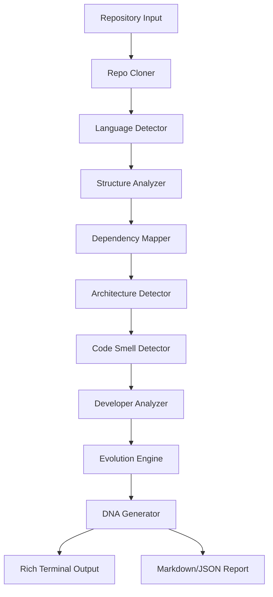

<div align="center">
  
  
  <br/>

  <h1>🧬 CodeDNA</h1>
  <p><b>Software Intelligence System — A Genetic Analyzer for Code</b></p>
  <i>Feed it any repository. Get a complete DNA profile — architecture, dependencies, code smells, developer patterns, and evolution timeline.</i>

  <br/>

  [](https://github.com/shenald-dev/codedna/actions)
  [](https://python.org)
  [](LICENSE)
</div>

---

## 📑 Table of Contents
- [✨ What is CodeDNA?](#-what-is-codedna)
- [🚀 Enterprise Features](#-enterprise-features)
- [🏗️ Architecture & Pipeline](#️-architecture--pipeline)
- [🛠️ Quick Start Guide](#️-quick-start-guide)
- [💻 Comprehensive Usage](#-comprehensive-usage)
- [🧬 Example Output](#-example-output)
- [🤝 Contributing](#-contributing)

---

## ✨ What is CodeDNA?

**CodeDNA** reverse-engineers any codebase and generates a comprehensive "DNA profile". It acts as an automated software architect, reading through tens of thousands of lines of code to distill exactly what a system does, how it's built, and where the technical debt is hiding.

| Analysis | What it reveals |
|----------|----------------|
| 🏗️ **Architecture Pattern** | Monolith, MVC, Layered, Microservices, Plugin, Event-Driven |
| 📊 **Language Distribution** | Files, lines, and percentage per language (50+ supported) |
| 🔗 **Dependency Graph** | Module imports, circular deps, centrality (PageRank, betweenness) |
| 🐛 **Code Smells** | God classes, large files, long functions, circular deps |
| 👥 **Developer Genome** | Contributors, roles, collaboration, bus factor, hotspots |
| 📈 **Evolution Timeline** | Growth patterns, churn, architecture shifts over time |

---

## 🚀 Enterprise Features

- **Blazing Fast CLI:** Analyzes massive repositories locally in seconds using parallel AST traversal.
- **Deep Git Telemetry:** Maps developer collaboration networks to identify "bus factor" risks.
- **Export Formats:** Generates human-readable Markdown reports or machine-readable JSON for CI/CD integration.
- **Extensible Plugin System:** Easily write custom analyzers (e.g., security scanners) to inject into the DNA sequence.

---

## 🏗️ Architecture & Pipeline

CodeDNA uses a highly modular **9-stage analysis pipeline**:



---

## 🛠️ Quick Start Guide

### Installation
We recommend installing in a virtual environment.
```bash
git clone https://github.com/shenald-dev/codedna.git
cd codedna
pip install -e ".[dev]"
```

---

## 💻 Comprehensive Usage

Run the CLI against any public GitHub URL or local path:

```bash
# Analyze a public GitHub repository
codedna analyze https://github.com/user/project

# Analyze a local repository
codedna analyze ./my-project

# Self-analyze CodeDNA itself!
codedna analyze .

# Save reports to a directory without terminal visualization
codedna analyze . --no-visualize --output reports/ --format json
```

### Advanced Configuration
Limit the max file size scanned to speed up massive monorepo traversal:
```bash
CODEDNA_MAX_FILE_SIZE=10485760 codedna analyze .
```

---

## 🧬 Example Output

CodeDNA generates stunning, rich terminal output:

```
╭──────────────────────────────────────────────────╮
│ 🧬 CodeDNA Profile                               │
│ Source: https://github.com/user/project          │
│ System: Layered Architecture                     │
╰──────────────────────────────────────────────────╯

📊 Language Distribution
┌────────────┬───────┬────────┬───────┬──────────────────────┐
│ Language   │ Files │  Lines │ Share │                      │
├────────────┼───────┼────────┼───────┼──────────────────────┤
│ Python     │    42 │  3,841 │ 65.2% │ █████████████░░░░░░░ │
│ TypeScript │    18 │  1,560 │ 26.5% │ ██████░░░░░░░░░░░░░░ │
└────────────┴───────┴────────┴───────┴──────────────────────┘

╭─ 🩺 Health ───────────────────────────────────────╮
│ Overall: Fair                                     │
│ 🔴 Critical: 1  🟡 Warning: 4  🔵 Info: 12        │
│ 🔴 God Class in `services.py`: 18 methods         │
╰───────────────────────────────────────────────────╯
```

---

## 🤝 Contributing
- 🐛 **Bug reports** — Open an issue
- ✨ **New analyzers** — PRs welcome! Just add your module to `codedna/analyzers/`.

---
> *Built by a Vibe Coder 🧘 • Software has DNA too.*
