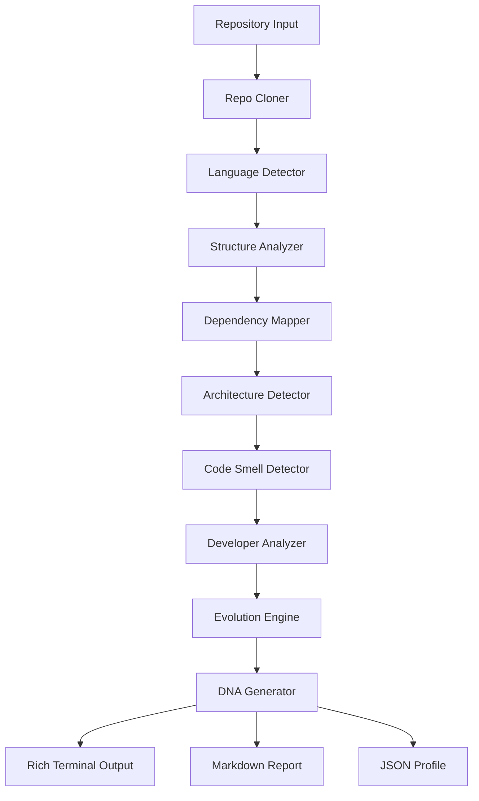

<div align="center">

# 🧬 CodeDNA

### Software Intelligence System — A Genetic Analyzer for Code

[](https://github.com/shenald-dev/codedna/actions)
[](https://python.org)
[](LICENSE)

> Feed it any repository. Get a complete DNA profile — architecture, dependencies, code smells, developer patterns, and evolution timeline.

</div>

---

## ✨ What is CodeDNA?

**CodeDNA** reverse-engineers any codebase and generates a "DNA profile" describing its:

| Analysis | What it reveals |
|----------|----------------|
| 🏗️ **Architecture Pattern** | Monolith, MVC, Layered, Microservices, Plugin, Event-Driven |
| 📊 **Language Distribution** | Files, lines, and percentage per language (50+ supported) |
| 🔗 **Dependency Graph** | Module imports, circular deps, centrality (PageRank, betweenness) |
| 🐛 **Code Smells** | God classes, large files, long functions, circular deps |
| 👥 **Developer Genome** | Contributors, roles, collaboration, bus factor, hotspots |
| 📈 **Evolution Timeline** | Growth patterns, churn, architecture shifts over time |
| 🧬 **DNA Signature** | Compact profile string: `LANG:PYT | ARCH:LAY | SIZE:MD | TEAM:SOLO` |

---

## 🚀 Quick Start

### Installation

```bash
git clone https://github.com/shenald-dev/codedna.git
cd codedna
pip install -e ".[dev]"
```

### Usage

```bash
# Analyze a GitHub repository
codedna analyze https://github.com/user/project

# Analyze a local repository
codedna analyze ./my-project

# Self-analyze CodeDNA itself
codedna analyze .

# Save reports to a directory
codedna analyze . --output reports/ --format both

# Skip terminal visualization
codedna analyze . --no-visualize --output reports/
```

---

## 📋 CLI Reference

```
Usage: codedna analyze [OPTIONS] SOURCE

  Analyze a repository and generate its DNA profile.

Options:
  -o, --output PATH              Output directory for reports
  -f, --format [markdown|json|both]  Output format (default: both)
  -d, --depth INTEGER            Git history depth (default: 100)
  --no-visualize                 Skip terminal visualization
  --help                         Show this message
```

---

## 🧬 Example DNA Profile Output

```
╭──────────────────────────────────────────────────╮
│ 🧬 CodeDNA Profile                               │
│                                                   │
│ Source: https://github.com/user/project           │
│ System: Layered                                   │
│ Date:   2026-03-13                                │
╰──────────────────────────────────────────────────╯

📊 Language Distribution
┌────────────┬───────┬────────┬───────┬──────────────────────┐
│ Language   │ Files │  Lines │ Share │                      │
├────────────┼───────┼────────┼───────┼──────────────────────┤
│ Python     │    42 │  3,841 │ 65.2% │ █████████████░░░░░░░ │
│ TypeScript │    18 │  1,560 │ 26.5% │ ██████░░░░░░░░░░░░░░ │
│ Shell      │     5 │    489 │  8.3% │ ██░░░░░░░░░░░░░░░░░░ │
└────────────┴───────┴────────┴───────┴──────────────────────┘

╭─ 🏗️ Architecture ─────────────────────────────────╮
│ Detected Patterns:                                 │
│   • Layered (80%) ████████                         │
│   • CLI Tool (66%) ██████                          │
│                                                    │
│ Infrastructure Traits:                             │
│   ✅ Containerized                                 │
│   ✅ CI/CD Enabled                                 │
│   ✅ Tested                                        │
│                                                    │
│ Coupling: Moderate                                 │
╰────────────────────────────────────────────────────╯

╭─ 🩺 Health ───────────────────────────────────────╮
│ Overall: Fair                                      │
│                                                    │
│ 🔴 Critical: 1  🟡 Warning: 4  🔵 Info: 12       │
│                                                    │
│ Risk Signals:                                      │
│ 🔴 God Class in `services.py`: 18 methods          │
│ 🟡 Large File in `engine.py`                       │
╰────────────────────────────────────────────────────╯

╭─ 🧬 DNA Signature ────────────────────────────────╮
│ LANG:PYT | ARCH:LAY | SIZE:MD | TEAM:SOLO | H:1   │
╰────────────────────────────────────────────────────╯
```

---

## 🏗️ Architecture

CodeDNA uses a **9-stage analysis pipeline**:



### Analysis Modules

| Module | Purpose | Tech |
|--------|---------|------|
| `repo_cloner.py` | Clone/resolve repos | GitPython |
| `language_detector.py` | Detect 50+ languages | File extension analysis |
| `structure_analyzer.py` | File tree + module boundaries | Path traversal |
| `dependency_mapper.py` | Import graph + centrality | NetworkX, regex |
| `architecture_detector.py` | Pattern classification | Rule-based heuristics |
| `code_smell_detector.py` | Structural issue detection | AST-lite parsing |
| `developer_analyzer.py` | Contributor behavior | Git log analysis |
| `evolution_engine.py` | Growth/churn tracking | Commit history |
| `dna_generator.py` | Final profile aggregation | — |

---

## 📁 Project Structure

```
codedna/
├── codedna/
│   ├── __init__.py
│   ├── cli.py                        # CLI entry point (Click)
│   ├── analyzers/
│   │   ├── repo_cloner.py            # Git clone & cache
│   │   ├── language_detector.py      # 50+ language detection
│   │   ├── structure_analyzer.py     # File tree analysis
│   │   ├── dependency_mapper.py      # Import graph (NetworkX)
│   │   ├── architecture_detector.py  # Pattern detection
│   │   ├── code_smell_detector.py    # Smell detection
│   │   ├── developer_analyzer.py     # Git contributor analysis
│   │   ├── evolution_engine.py       # Codebase evolution
│   │   └── dna_generator.py         # DNA profile generator
│   └── visualization/
│       └── renderer.py               # Rich terminal renderer
├── tests/
│   └── test_analyzers.py             # 16 pytest tests
├── .github/workflows/ci.yml
├── pyproject.toml
├── LICENSE
└── README.md
```

---

## 🧪 Testing

```bash
# Run all tests
pytest -v

# Run with coverage
pytest --cov=codedna --cov-report=term-missing

# Run a specific test class
pytest tests/test_analyzers.py::TestLanguageDetector -v
```

---

## 🔌 Extending CodeDNA

### Adding a New Analyzer

1. Create `codedna/analyzers/my_analyzer.py`:

```python
class MyAnalyzer:
    def analyze(self, repo_path: Path) -> dict:
        # Your analysis logic
        return {"result": "data"}
```

2. Wire it into `codedna/cli.py`:

```python
from .analyzers.my_analyzer import MyAnalyzer
# ... inside the analyze command:
my_data = MyAnalyzer().analyze(repo_path)
```

3. Add it to the DNA generator input.

---

## 🤝 Contributing

- 🐛 **Bug reports** — Open an issue
- ✨ **New analyzers** — PRs welcome!
- 📖 **Docs** — Always appreciated

---

## 📄 License

MIT © [shenald-dev](https://github.com/shenald-dev)

---

<div align="center">
<sub>Built by a Vibe Coder 🧘 • Software has DNA too.</sub>
</div>
