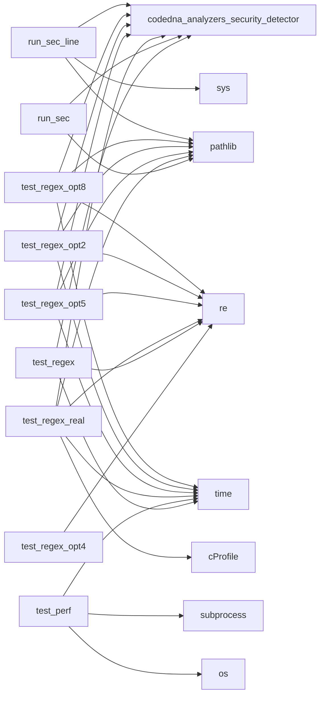

# 🧬 CodeDNA Profile

> Analyzed: `.`
> Date: 2026-03-29


---

## 🏗️ System Type: **Monolith**

### Infrastructure Traits
- ✅ CI/CD Enabled
- ✅ Tested
- ✅ Type-Safe

## 📊 Language Distribution

| Language | Files | Lines | Share |
|----------|-------|-------|-------|
| Python | 43 | 3,296 | 77.9% `███████████████` |
| Markdown | 5 | 426 | 10.1% `██` |
| JSON | 4 | 165 | 3.9% `█` |
| TOML | 1 | 54 | 1.3% `█` |
| YAML | 1 | 34 | 0.8% `█` |
| HTML | 1 | 255 | 6.0% `█` |

## 🩺 Health Score: **Critical**

- 🔴 Critical: 1
- 🟡 Warning: 5
- 🔵 Info: 17

## ⚠️ Risk Signals

- 🔴 Hardcoded Secret in `test_regex_opt9.py:27`: Detected RSA Private Key (----***----)
- 🔴 Hardcoded Secret in `test_regex_opt9.py:28`: Detected SSH Private Key (----***----)
- 🔴 Hardcoded Secret in `tests/test_analyzers.py:27`: Detected AWS Access Key (AKIA***MPLE)
- 🔴 Hardcoded Secret in `tests/test_analyzers.py:27`: Detected Generic API Key / Token (KEY ***PLE')
- 🔴 Hardcoded Secret in `codedna/analyzers/security_detector.py:13`: Detected RSA Private Key (----***----)
- 🔴 Hardcoded Secret in `codedna/analyzers/security_detector.py:14`: Detected SSH Private Key (----***----)
- 🔴 God Class in `tests/test_analyzers.py`: 20 methods detected (threshold: 15)
- 🟡 Long Function in `codedna/cli.py`

## 🔗 Dependency Graph

- Modules: **105**
- Connections: **175**
- Density: **0.016**
- Circular Dependencies: **None ✅**



## 👥 Developer Genome

- Contributors: **1**
- Bus Factor: **1**
- Primary Architect: **Shenal D**

| Developer | Role | Commits |
|-----------|------|---------|
| Shenal D | Primary Architect | 1 |

## 📈 Evolution

- Total Commits: **1**
- First Commit: 2026-03-28
- Patterns: Insufficient data

## 🧬 DNA Signature

```
LANG:PYT | ARCH:MON | SIZE:LG | TEAM:SOLO | HEALTH:1
```

---
*Generated by [CodeDNA](https://github.com/shenald-dev/codedna)*