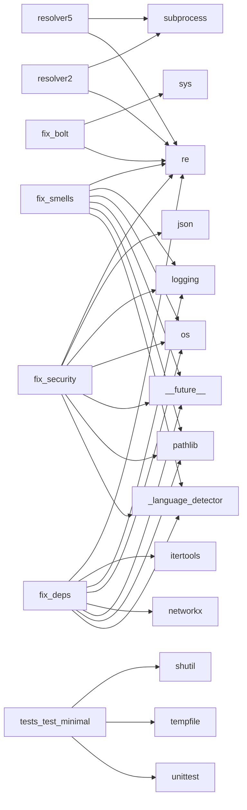

# 🧬 CodeDNA Profile

> Analyzed: `.`
> Date: 2026-05-28


---

## 🏗️ System Type: **Monolith**

### Infrastructure Traits
- ✅ CI/CD Enabled
- ✅ Tested
- ✅ Type-Safe

## 📊 Language Distribution

| Language | Files | Lines | Share |
|----------|-------|-------|-------|
| Python | 35 | 3,491 | 65.2% `█████████████` |
| Markdown | 5 | 1,371 | 25.6% `█████` |
| JSON | 4 | 130 | 2.4% `█` |
| TOML | 1 | 58 | 1.1% `█` |
| YAML | 1 | 34 | 0.6% `█` |
| HTML | 1 | 267 | 5.0% `█` |

## 🩺 Health Score: **Needs Attention**

- 🔴 Critical: 1
- 🟡 Warning: 6
- 🔵 Info: 13

## ⚠️ Risk Signals

- 🔴 God Class in `tests/test_analyzers.py`: 25 methods detected (threshold: 15)
- 🟡 Long Function in `codedna/cli.py`
- 🟡 Long Function in `codedna/analyzers/developer_analyzer.py`
- 🟡 Long Function in `codedna/analyzers/dna_generator.py`
- 🟡 Long Function in `codedna/analyzers/dna_generator.py`
- 🟡 Long Function in `codedna/visualization/html_export.py`
- 🟡 Long Function in `codedna/visualization/html_export.py`

## 🔗 Dependency Graph

- Modules: **97**
- Connections: **164**
- Density: **0.0176**
- Circular Dependencies: **None ✅**



## 👥 Developer Genome

- Contributors: **2**
- Bus Factor: **1**
- Primary Architect: **Shenal D**

| Developer | Role | Commits |
|-----------|------|---------|
| Shenal D | Primary Architect | 18 |
| google-labs-jules[bot] | Core Maintainer | 10 |

## 📈 Evolution

- Total Commits: **28**
- First Commit: 2026-05-12
- Patterns: Stable Evolution

## 🧬 DNA Signature

```
LANG:PYT | ARCH:MON | SIZE:MD | TEAM:DUO | HEALTH:1
```

---
*Generated by [CodeDNA](https://github.com/shenald-dev/codedna)*